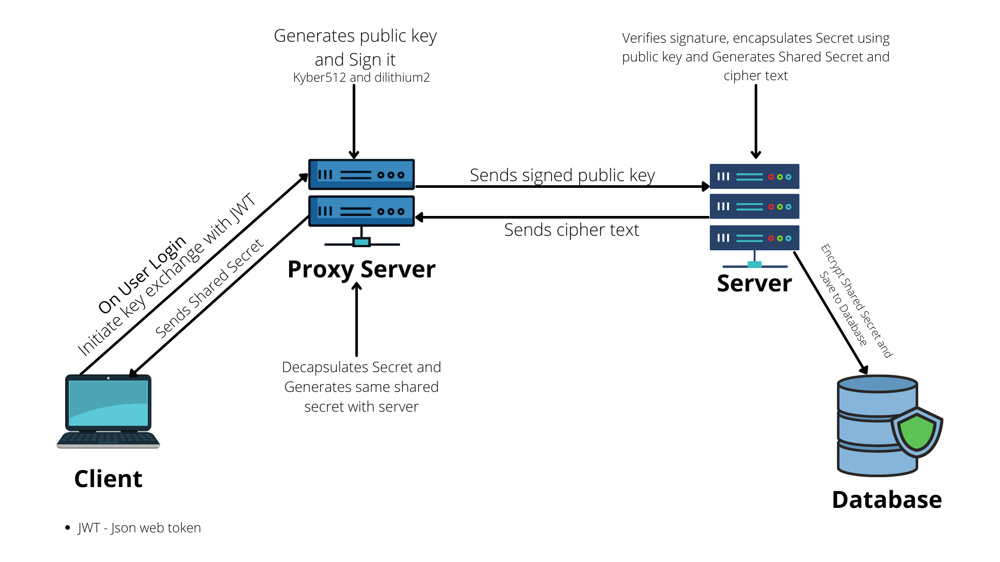

# Post Quantum Password Manager

This is a password manager developed in Electron using the Electron-React Boilerplate. It uses post-quantum cryptographic algorithms to ensure secure communication. 

It uses a passphrase to generate a key which is used to encrypt and decrypt your passwords on the client side.

Before passwords are retreived or sent to the server, a key exchange is performed using Kyber-512 and a digital signature is created using dilithium-2. Subsequent communications use this exchanged key as well as JWTs.

The key exchange is performed on behalf of the client by a [proxy server.](https://github.com/Areezy/keyexchange-proxy)

The Research article that this project was used to support can be on [Research Gate.](https://www.researchgate.net/publication/365608542_A_Password_Manager_for_Post-Quantum_Era)


## Features

- Post-Quantum Cryptographic Algorithms for secure communication (Public key exchange and Digital Signature Verification)
- Authentication and Authorization using JWTs
- Client side Encryption and Decryption
- Secure key generation
- Search Functionality

## Built With

- React
- TypeScript
- Electron (React Electron Boilerplate)
- TailwindCSS
- ChakraUI
- CryptoJS
- Zod

## Key Exchange Flow



## Installation guide

In order to run this application locally, this client, [the proxy-server](https://github.com/Areezy/keyexchange-proxy) and [the server](https://github.com/Areezy/password-manager-server) must all be running.

Installation guides for those are in their respective repositories.

For this client however, run

```
git clone
npm install
npm start
```

Before the code can run, some environment variables need to be set. These are

- "KEYSALT" Which is the salt for the encryption key generation function.
- "SERVER_ADDRESS" Which is the URL for the server.
- "PROXY_ADDRESS" Which is the URL for the proxy server.


## Screenshot

